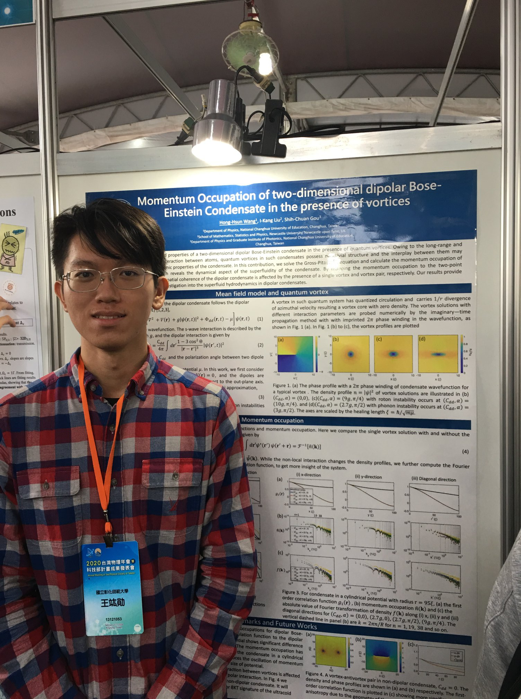
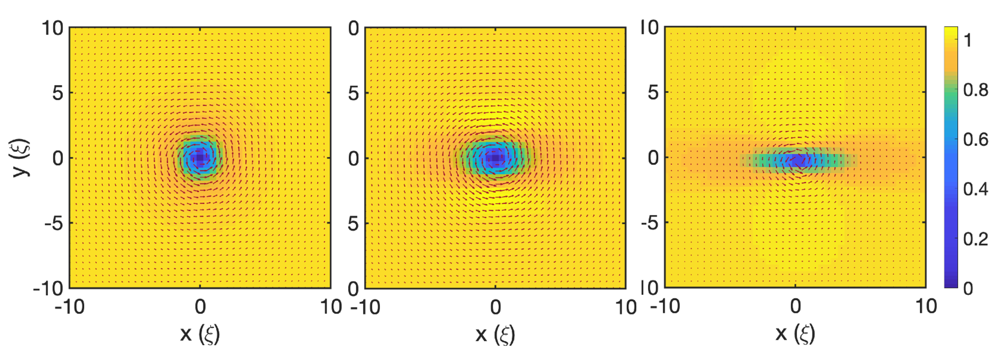

In this work, we numerically investigate the momentum occupation of the 2D dipolar Bose-Einstein condensate in the presence of vortices

Check out the [poster award][poster-award-web] for more info.

[poster-award-web]: [https://jekyllrb.com/docs/home](https://tps2020.conf.tw/site/news_show.aspx?sid=1312&lang=en&pid=221)

